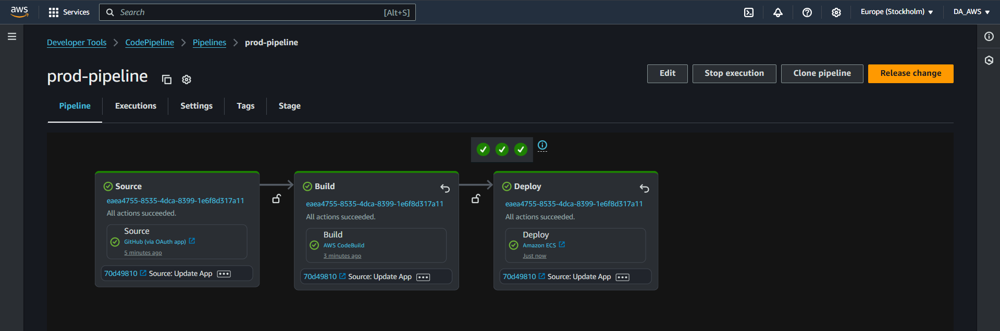
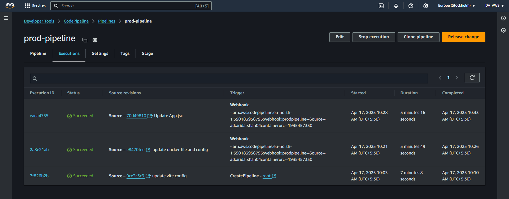

# 🚀 ECS CI/CD Pipeline with Fargate

## 📖 Project Overview

This project demonstrates a **complete CI/CD pipeline** for containerized applications using **Amazon ECS Fargate**, **ECR**, and **AWS CodePipeline**. The architecture follows security best practices with ECS tasks deployed in private subnets, accessible only through an Application Load Balancer.

## 🏗️ Architecture


### 🔄 **Complete Workflow**

1. **Developer pushes code** to GitHub repository
2. **CodePipeline** automatically detects changes via webhook
3. **CodeBuild** builds Docker image and pushes to ECR
4. **ECS Service** pulls new image and performs rolling deployment
5. **Application Load Balancer** routes traffic to healthy tasks
6. **Zero-downtime deployment** completed automatically

## 📦 Architecture Components

The Terraform configuration creates:

| Component | Purpose | Configuration |
|-----------|---------|---------------|
| **VPC** | Network isolation | `10.0.0.0/16` with public/private subnets |
| **ALB** | Load balancing | Internet-facing in public subnets |
| **ECS Fargate** | Container hosting | Tasks in private subnets |
| **ECR** | Image registry | Private repository with scanning |
| **CodePipeline** | CI/CD orchestration | GitHub → Build → Deploy |
| **CodeBuild** | Image building | Docker builds with ECR push |
| **VPC Endpoints** | AWS service access | ECR, S3, CloudWatch Logs endpoints |

## 🔄 **Pipeline Overview**



## Quick Start

Pick one of the deployment guides:

* **[Deploy with AWS Console](./docs/console.md)**
* **[Deploy with Terraform](./docs/terraform.md)**

## 🔐 Security Best Practices

### Network Security
- ✅ **ECS tasks in private subnets** - No direct internet access
- ✅ **ALB in public subnets** - Controlled entry point
- ✅ **Security groups** restrict traffic flow
- ✅ **VPC Endpoints** for secure AWS service access

### IAM Security
- ✅ **Least privilege roles** for each service
- ✅ **Separate execution roles** for ECS tasks
- ✅ **Service-specific permissions** for CodeBuild/CodePipeline

### Container Security
- ✅ **ECR image scanning** enabled
- ✅ **Private container registry**
- ✅ **Lifecycle policies** for image cleanup

## 🛠 Troubleshooting

### Health Check Issues

If encounter issues such as a `502 Bad Gateway`:

1. **Check Target Group Health**: Verify ECS tasks are healthy in the target group
2. **Security Groups**: Ensure ALB security group can reach ECS tasks on container port
3. **Container Logs**: Check CloudWatch logs for application errors

```bash
# View ECS service events
aws ecs describe-services --cluster ecs-cicd-pipeline-cluster --services ecs-cicd-pipeline-service
```

### Pipeline Failures

If CodePipeline fails:

1. **Check CodeBuild logs** in CloudWatch
2. **Verify GitHub token** has correct permissions
3. **Check IAM roles** have necessary permissions
4. **Ensure buildspec.yml** is in repository root

### ECR Access Issues

If ECS tasks can't pull images:

1. **Verify VPC Endpoints** are in "Available" state
2. **Check route tables** for private subnets
3. **Confirm ECS task execution role** has ECR permissions

---