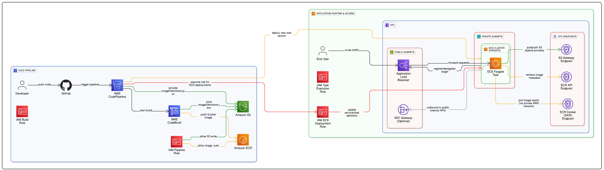

# 🚀 ECS CI/CD Pipeline with Fargate

## 📖 Project Overview

This project demonstrates a **complete CI/CD pipeline** for containerized applications using **Amazon ECS Fargate**, **ECR**, and **AWS CodePipeline**. The architecture follows security best practices with ECS tasks deployed in private subnets, accessible only through an Application Load Balancer.

## 🏗️ Architecture

1. **Developer pushes code** to GitHub repository
2. **CodePipeline** automatically detects changes via CodeStar connection
3. **CodeBuild** builds Docker image and pushes to ECR
4. **ECS Service** pulls new image and performs rolling deployment
5. **Application Load Balancer** routes traffic to healthy tasks
6. **Zero-downtime deployment** completed automatically

## 📦 Infrastructure Components

### **Core Services**

| Component | Purpose | Configuration | Security |
|-----------|---------|---------------|----------|
| **VPC** | Network isolation | `10.0.0.0/16` CIDR | Private/Public subnets |
| **ALB** | Load balancing | Internet-facing | Security groups |
| **ECS Fargate** | Container hosting | Serverless compute | Private subnets only |
| **ECR** | Image registry | Private repository | Vulnerability scanning |
| **CodePipeline** | CI/CD orchestration | GitHub integration | IAM roles |
| **CodeBuild** | Image building | Docker builds | Secure build environment |
| **VPC Endpoints** | Private connectivity | AWS services access | No internet required |

## 🔄 **Deployment Overview**

***CodePipeline Architecture:***

***CodeBuild Executions***

***ECR Repository with Images***

***ECS Service with Running Tasks***

***S3 Bucket for CodePipeline Artifacts***

## Quick Start

Pick one of the deployment guides:

* **[Deploy with AWS Console](./docs/console.md)**
* **[Deploy with Terraform](./docs/terraform.md)**

## 🔐 Security Best Practices

### Network Security
- ✅ **ECS tasks in private subnets** - No direct internet access
- ✅ **ALB in public subnets** - Controlled entry point
- ✅ **Security groups** restrict traffic flow
- ✅ **VPC Endpoints** for private AWS service access (S3, ECR)
- ✅ **NAT Gateway** for controlled outbound access

### IAM Security
- ✅ **Least privilege roles** for each service
- ✅ **Separate execution roles** for ECS tasks
- ✅ **Service-specific permissions** for CodeBuild/CodePipeline

### Container Security
- ✅ **ECR image scanning** enabled
- ✅ **Private container registry**
- ✅ **Lifecycle policies** for image cleanup
---