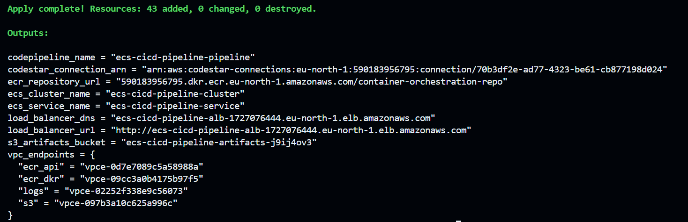
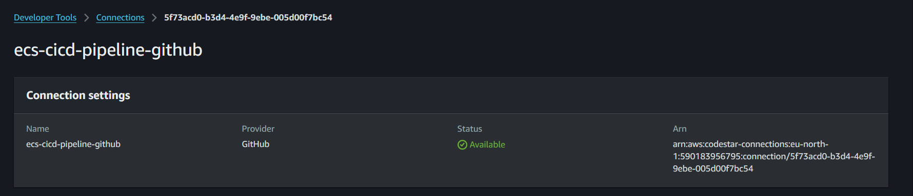
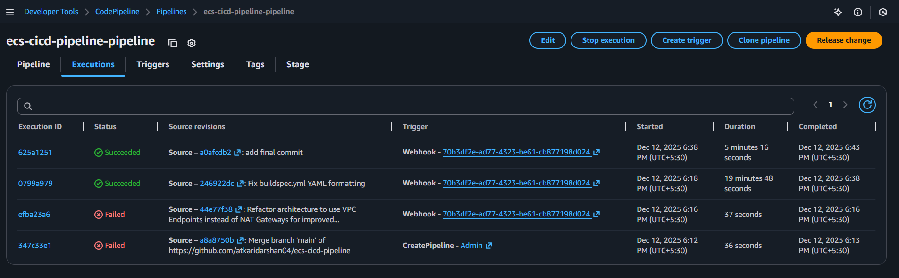
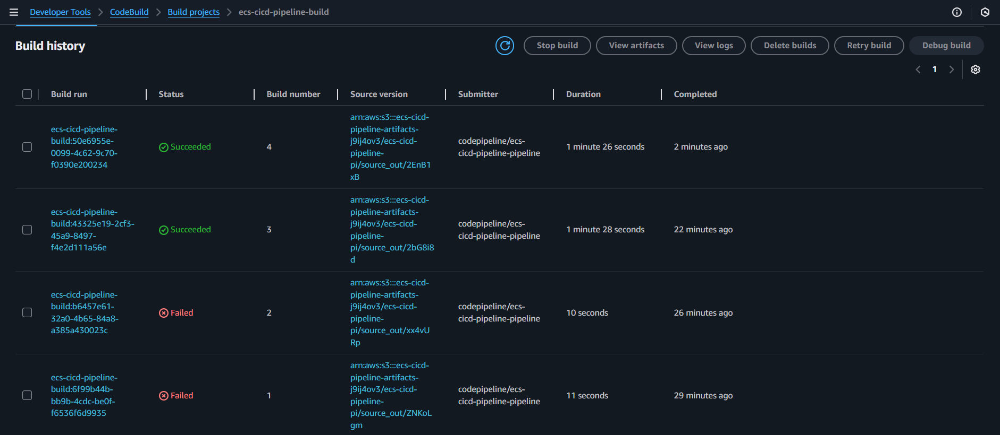
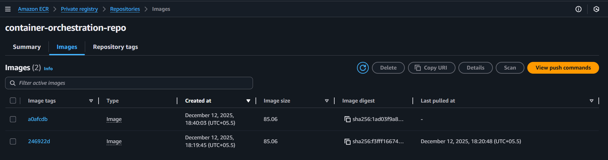
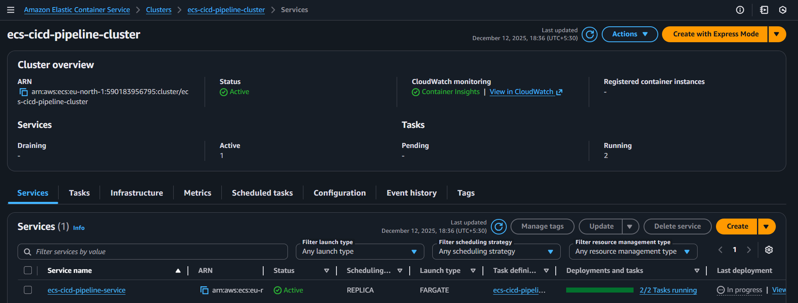
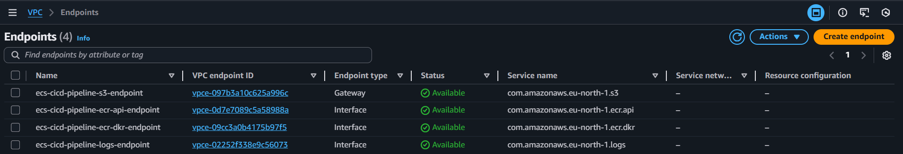
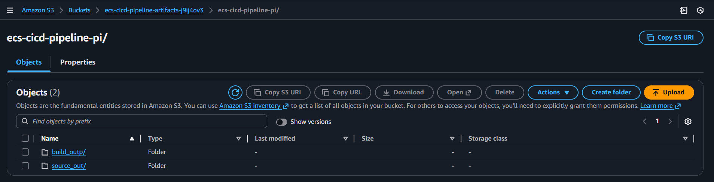

# 🚀 Terraform Deployment Guide

### **Step 1: Navigate to Terraform Directory**

```bash
cd terraform
```

### **Step 2: Configure Variables**

Create your configuration file:

```bash
cp terraform.tfvars.example terraform.tfvars
```

Edit `terraform.tfvars` with your specific values:

```hcl
# AWS Configuration
aws_region = "eu-north-1"

# Project Configuration  
project_name = "ecs-cicd-pipeline"
ecr_repository_name = "container-orchestration-repo"

# GitHub Configuration
github_repo = "https://github.com/your-username/ecs-cicd-pipeline"
github_branch = "main"

# Container Configuration
container_port = 5173
alb_port = 80
desired_count = 2
cpu = 256
memory = 512
```

### **Step 3: Initialize Terraform**

Initialize the working directory and download providers:

```bash
terraform init
```

### **Step 4: Plan Infrastructure**

Review the execution plan:

```bash
terraform plan
```

This shows exactly what resources will be created, modified, or destroyed.

### **Step 5: Deploy Infrastructure**

Apply the configuration:

```bash
terraform apply --auto-approve
```

**Expected Output:**


## 🔗 Post-Deployment Configuration

### **Step 6: Approve GitHub Connection**

1. Navigate to **AWS CodePipeline Console**
2. Find your pipeline and click on the **Source** stage
3. **Approve the GitHub connection** when prompted



4. **Retry the Source stage** to proceed with the pipeline

### **Step 7: Verify Deployment**

Access your application using the ALB DNS name from the Terraform output:

```bash
# Get the load balancer URL
terraform output load_balancer_url
```

## 📊 Resource Verification

### **CodePipeline Execution**
Monitor your CI/CD pipeline:




### **CodeBuild Projects**
View build configurations:



### **ECR Repository**
Check container images:



### **ECS Service**
Monitor running tasks:



### **VPC Endpoints**
Verify private connectivity:



### **S3 Artifacts Bucket**
Pipeline artifact storage:



## 🔄 CI/CD Pipeline Testing

### **Trigger Pipeline**

1. **Make code changes** to your application
2. **Push to GitHub** repository
3. **Monitor pipeline** execution in AWS Console
4. **Verify deployment** via ALB DNS name

### **Pipeline Stages**

| Stage | Action | Duration |
|-------|--------|----------|
| **Source** | GitHub checkout | ~30 seconds |
| **Build** | Docker build & ECR push | ~2-5 minutes |
| **Deploy** | ECS service update | ~3-5 minutes |

## 🛠️ Troubleshooting

### **Common Issues**

#### **GitHub Connection Failed**
```bash
# Check CodeStar connection status
aws codestar-connections list-connections
```

#### **ECS Tasks Not Starting**
```bash
# Check ECS service events
aws ecs describe-services \
  --cluster $(terraform output -raw ecs_cluster_name) \
  --services $(terraform output -raw ecs_service_name)
```

#### **ALB Health Check Failures**
```bash
# Check target group health
aws elbv2 describe-target-health \
  --target-group-arn <target-group-arn>
```

### **Debugging Commands**

```bash
# View Terraform state
terraform show

# Check specific resource
terraform state show aws_ecs_service.app

# View logs
aws logs describe-log-groups --log-group-name-prefix /ecs/
```

## 🔐 Security Features

- ✅ **Private Subnets**: ECS tasks isolated from internet
- ✅ **VPC Endpoints**: Private AWS service access
- ✅ **Security Groups**: Restrictive network rules
- ✅ **IAM Roles**: Least privilege access
- ✅ **ECR Scanning**: Container vulnerability detection

## 📈 Monitoring & Observability

- **CloudWatch Container Insights**: Enabled on ECS cluster
- **ALB Access Logs**: Available in S3 (optional)
- **VPC Flow Logs**: Network traffic monitoring (optional)
- **CodePipeline Metrics**: Build and deployment tracking

## 🧹 Cleanup

To destroy all resources:

```bash
terraform destroy --auto-approve
```

---
